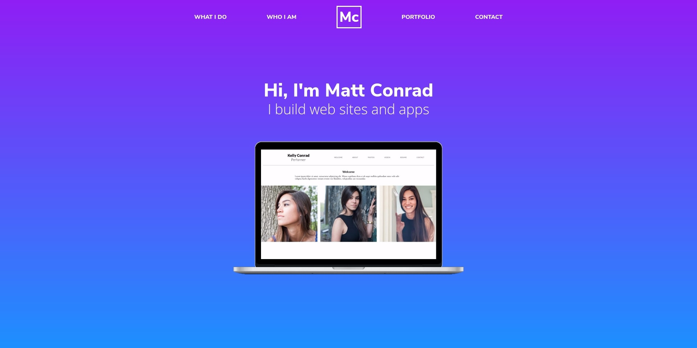

# Portfolio [](https://travis-ci.org/matthew-conrad/portfolio.svg?branch=master)

My personal portfolio site featuring some of my best work in web development.
## Goals
- Showcase some of my best work in web design and development
- Provide background information and contact information
## Under the Hood
This site is made with :heart: using tools like VS Code and Chrome DevTools in a Linux environment.
## To Set up Locally
You can take all the files of this site and run them on your computer as if it were live online, only it's just on your machine.
### Requirements
* [Git](http://git-scm.com/)

_If you have installed [GitHub Desktop](https://desktop.github.com), Git was also installed automatically._
To copy the repository's files from here onto your computer and to view and serve those files locally, at your computer's command line type:

```
git clone https://github.com/matthew-conrad/portfolio.git
```
